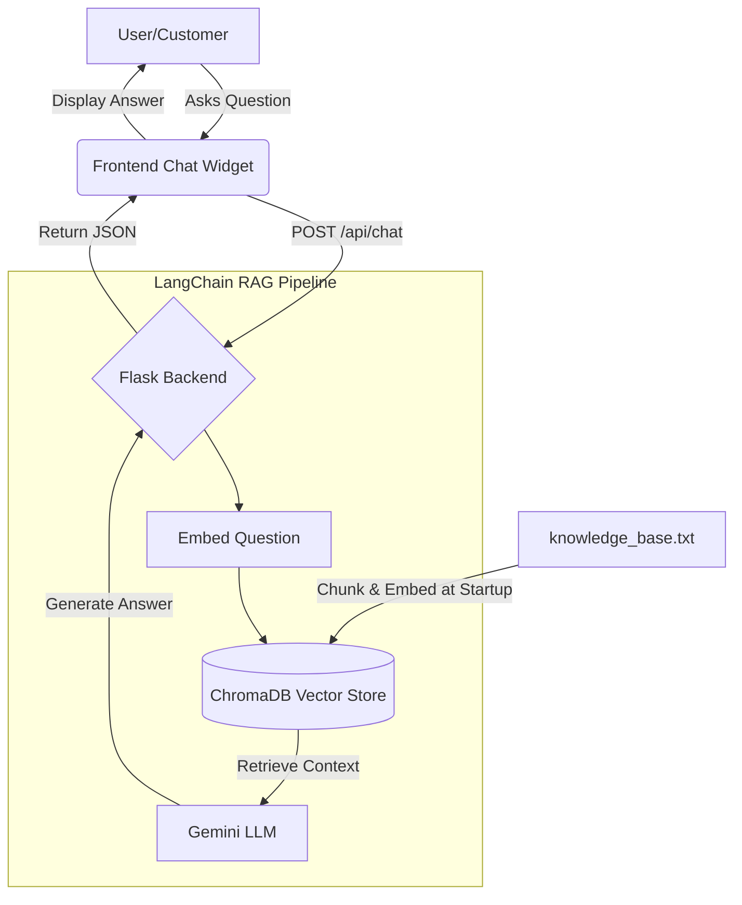

<div align="center">
  <h1>🍕 SwiftBite: AI-Powered Customer Support</h1>
  <p><strong>A full-stack, RAG-enabled chatbot designed to handle food delivery customer queries autonomously.</strong></p>
</div>

<br />

## ✨ Features
- **Intelligent RAG Pipeline**: Leverages LangChain and ChromaDB to ingest custom knowledge (FAQs, refund policies, delivery zones) and provide highly accurate, context-aware answers.
- **Conversational AI**: Uses Google's powerful Gemini LLMs to converse naturally with customers.
- **Minimalist, Modern UI**: A sleek Vanilla JS/CSS frontend with a floating chat widget and smooth glassmorphic animations.
- **Lightweight Backend**: A fast Flask API serving the LangChain retrieval chain.

## 🛠️ Technology Stack
- **Frontend**: HTML5, CSS3, Vanilla JavaScript
- **Backend**: Python, Flask, Flask-CORS
- **AI & RAG**: LangChain, Chroma (Vector DB), Google Generative AI (Gemini 1.5 Flash & Embeddings)

## 🧠 System Architecture



## 🚀 Quick Start Guide

Follow these steps to run the chatbot locally on your machine.

### Prerequisites
- Python 3.9+
- A Google Gemini API Key (get one from [Google AI Studio](https://aistudio.google.com/))

### 1. Clone the Repository
```bash
git clone https://github.com/Benedict-Johnson/Test-Antigravity.git
cd Test-Antigravity
```

### 2. Set Up the Backend
Navigate to the backend directory, create a virtual environment, and install dependencies.
```bash
cd backend
python -m venv venv

# On Windows:
.\venv\Scripts\activate
# On macOS/Linux:
# source venv/bin/activate

pip install -r requirements.txt
```

### 3. Configure API Keys
Rename the `.env.example` file to `.env` and add your Gemini API Key.
```env
GEMINI_API_KEY="your_actual_api_key_here"
```

### 4. Run the Application
You will need two terminal windows to run both the backend and frontend simultaneously.

**Terminal 1 (Backend):**
```bash
cd backend
.\venv\Scripts\activate
python app.py
# Server runs on http://localhost:5000
```

**Terminal 2 (Frontend):**
```bash
cd frontend
python -m http.server 8000
# Website runs on http://localhost:8000
```

Navigate to `http://localhost:8000` in your browser and click the floating chat icon to start talking to SwiftBite Support!

---
<div align="center">
  <i>Built with ❤️ using Python, LangChain, and Vanilla JS.</i>
</div>
